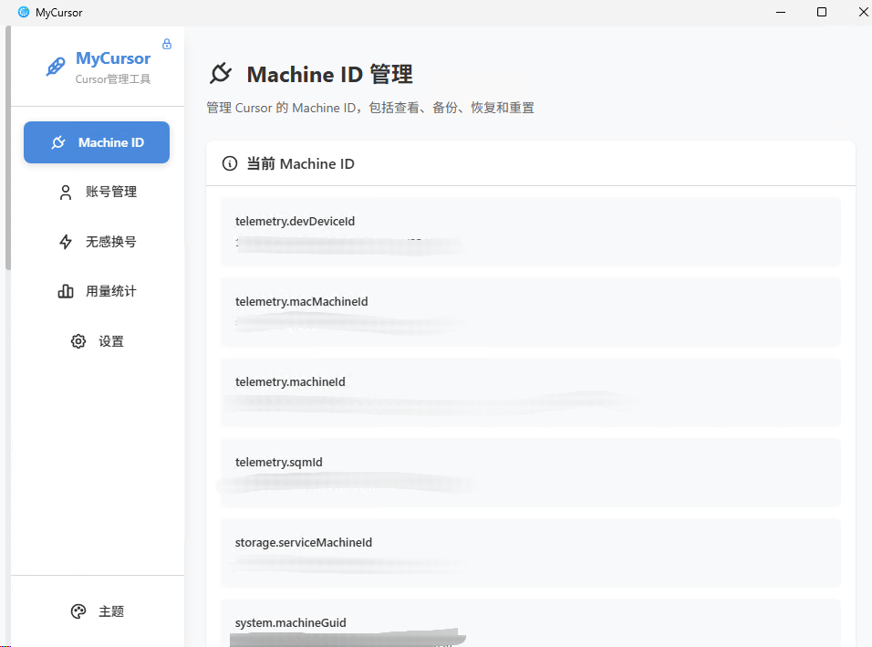
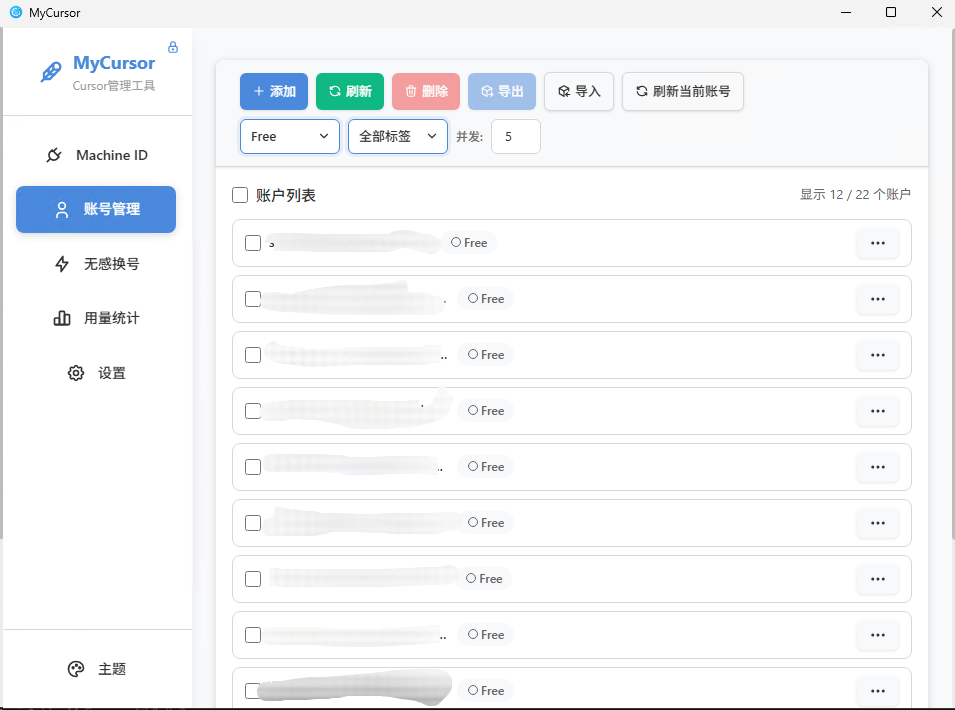
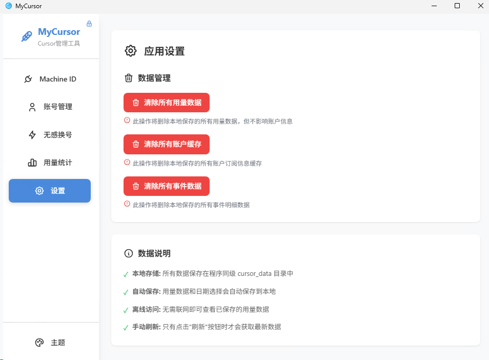

# MyCursor

[](https://github.com/h88782481/MyCursor/actions/workflows/build-public.yml)
[](https://github.com/h88782481/MyCursor/releases)

Cursor IDE 账户与 Machine ID 管理工具，免安装单文件运行，单实例。

## 功能

### Machine ID 管理
- 查看、备份、恢复、重置 Machine ID
- 完全重置（含 main.js / workbench.js 修改）
- 自定义 Cursor 路径配置（Windows）
- 禁用 / 恢复 Cursor 自动更新

### 多账户管理
- 添加 / 编辑 / 切换 / 删除账户
- 切换时可选：使用绑定机器码 / 生成新机器码 / 不操作机器码
- 账户自动绑定当前机器码，支持手动编辑
- 导入导出账户，批量刷新
- 标签分组，按标签和订阅类型动态筛选

### 无感换号（Seamless）
- 在 Cursor 内部一键切换账户，无需手动退出 / 重新登录
- 通过悬浮按钮打开账号选择器，可按订阅类型、标签筛选账户
- 本地 HTTP 服务仅监听 `127.0.0.1`，用于在不重启 Cursor 的前提下更新 Token 与 Machine ID

### 使用量统计
- 查看账户用量、消费明细、模型调用记录
- 支持聚合用量、用户分析、事件明细

### 其他
- 查看绑卡 / 订阅信息（内置浏览器打开 Stripe 管理页）
- 打开 Cursor 主页（内置浏览器，自动注入 Cookie 登录）
- 注销 Cursor 账户（调用官方 API）
- Windows 多用户同步（将当前账号同步到其他 Windows 用户的 Cursor）

## 界面预览

### Machine ID 管理



### 账号管理



### 无感换号


### 用量统计


### 设置



## 下载使用

从 [Releases](https://github.com/h88782481/MyCursor/releases) 页面下载：

| 平台 | 文件 | 说明 |
|------|------|------|
| Windows | `MyCursor.exe` | 免安装，双击直接运行 |
| macOS | `MyCursor_*.dmg` | 拖入 Applications 即可 |
| Linux | `mycursor_*.AppImage` / `.deb` | AppImage 免安装 |

### 数据存储

| 平台 | 路径 |
|------|------|
| Windows | exe 同级 `cursor_data/` |
| macOS / Linux | `~/.cursor_data/` |

数据目录包含：`account_cache.json`（账户）、`usage_data.json`（用量）、`events_data.json`（事件）、`config.json`（配置）、`logs/`（日志）

## 技术栈

| 层 | 技术 |
|----|------|
| 前端 | React 18 + TypeScript + Vite + Tailwind CSS |
| 后端 | Rust + Tauri 2 |
| 图表 | Recharts |
| 虚拟滚动 | react-window |

## 本地开发

```bash
npm install          # 安装依赖

# 仅启动 Web 前端（浏览器预览）
npm run dev

# 启动 Tauri 桌面应用（推荐开发方式）
npm run tauri:dev

# 构建前端静态资源
npm run build

# 构建各平台桌面应用安装包
npm run tauri:build

# 代码质量相关
npm run lint         # 代码检查
npm run format       # 格式化
```

环境要求：Node.js >= 18、Rust >= 1.70

## 项目结构

```
MyCursor/
├── src/                        # React 前端
│   ├── features/               # 按业务域组织的页面与局部组件 / hooks
│   │   ├── identity/           # Machine ID 管理
│   │   ├── accounts/           # 账号管理
│   │   ├── analytics/          # 用量统计
│   │   ├── seamless/           # 无感换号
│   │   └── settings/           # 设置
│   ├── components/             # 通用 UI 组件（卡片 / 表单 / 图表等）
│   ├── services/               # 服务层（账户、Machine ID、用量统计、配置等）
│   ├── hooks/                  # 自定义 Hooks
│   ├── types/                  # TypeScript 类型
│   ├── context/                # React Context
│   ├── styles/                 # 全局样式与主题（深色 / 浅色 / 透明）
│   ├── workers/                # Web Worker（数据预处理等）
│   └── utils/                  # 工具函数（加解密、性能分析、IndexedDB 等）
├── src-tauri/                  # Tauri Rust 后端
│   └── src/
│       ├── main.rs             # Tauri 入口
│       ├── lib.rs              # Tauri 命令注册与应用入口
│       ├── account_manager.rs  # 账户管理逻辑
│       ├── auth_checker.rs     # 认证 & 使用量查询
│       ├── machine_id.rs       # Machine ID 读取 / 备份 / 重置
│       ├── seamless.rs         # 无感换号 HTTP 服务与注入逻辑
│       └── logger.rs           # 日志系统
├── .github/workflows/          # CI/CD（tag 触发自动构建发布）
├── package.json
├── tailwind.config.js
└── vite.config.ts
```

## 许可证

本项目基于 **MIT License** 开源，完整条款见仓库根目录的 `LICENSE.txt` 文件。

